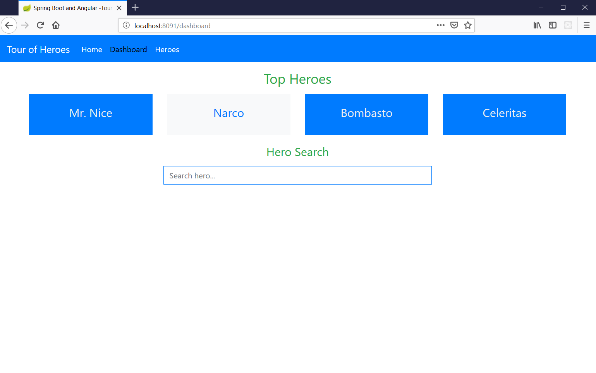
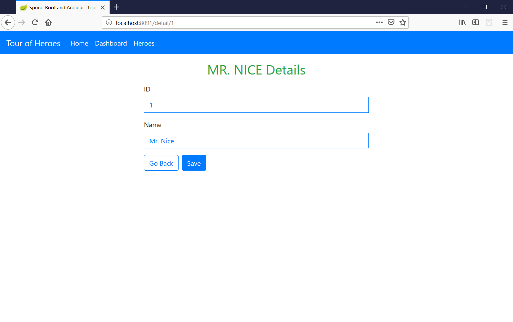
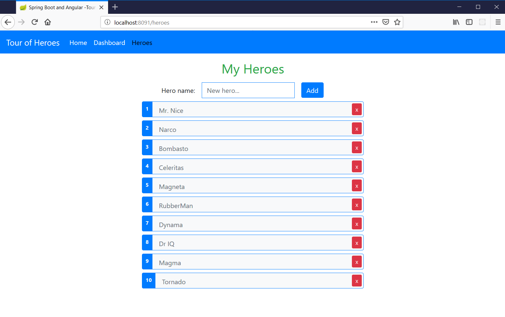

# Spring Boot and Angular
Modified Google's Tour of Heroes Angular application. Mocked web services were replaced with real ones created in Spring Boot.

## Clone
```
git clone https://github.com/julianjupiter/spring-boot-and-angular
```
## Build and Run
 - Windows
 ```
 .\mvnw.cmd package
 java -jar .\target\spring-boot-and-angular-0.0.1-SNAPSHOT.jar
 ```
 - GNU/Linux, UNIX
 ```
 ./mvnw package
 java -jar ./target/spring-boot-and-angular-0.0.1-SNAPSHOT.jar
 ```
## Screenshots
### Home/Dashboard

### Search

### Detail

### List/Add

